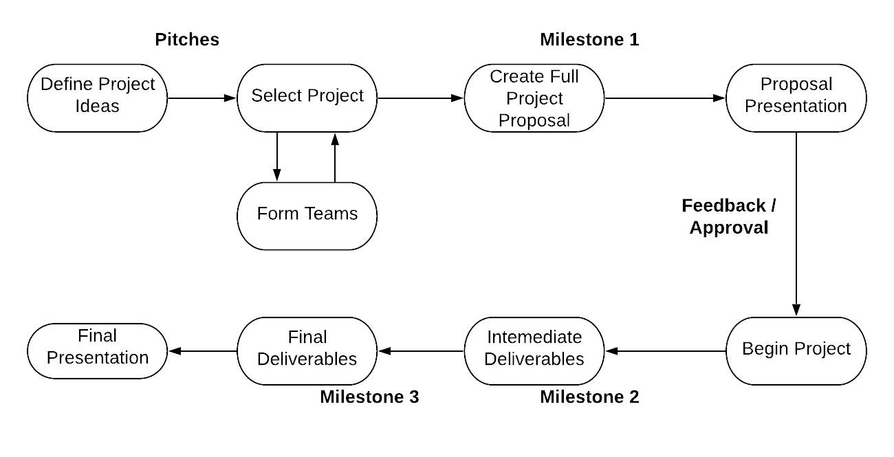

# CYBR8950
This repository contains a digitized version of the course content for the CYBR 4580/8950 Certification and Accreditation capstone course at the University of Nebraska at Omaha.

## Viewing these materials
The class materials are best viewed at [https://mlhale.github.io/CYBR4580-8950/](https://mlhale.github.io/CYBR4580-8950/)

## Overview
In this course, students will extend and apply their knowledge, accumulated from their undergraduate/graduate studies, towards defining, implementing, and assessing secured information systems. Students will demonstrate their ability to specify, apply, and assess different types of countermeasures at different points in a system or enterprise.

## Table of contents
<!-- TOC START min:1 max:3 link:true asterisk:false update:false -->
- [CYBR4580/8950](#cybr45808950)
  - [Viewing these materials](#viewing-these-materials)
  - [Overview](#overview)
  - [Table of contents](#table-of-contents)
  - [Online Discussion Area (Slack)](#online-discussion-area-slack)
  - [Location](#location)
  - [Projects](#projects)
<!--  - [Non-project work](#non-project-work)-->
  - [Former (Public) Projects](#former-public-projects)
  - [Syllabus](#syllabus)
  - [License](#license)
<!-- TOC END -->

## Online Discussion Area (Slack)
I have setup an online discussion board on slack.com for usage in this class. I can create some private channels for you to work in with your project teams (once created), but I want to be able to participate in your conversations - so please use the space on slack.

Go to [https://cybr-4580-8950.slack.com](https://cybr-4580-8950.slack.com) and use your unomaha email address to register an account. This will give you access to the course discussion and project collaboration spaces. Use the the general channel, your project channel, or private messages. I expect all project-related communication to live in your slack channel. If you need my attention please use the `@mlhale` syntax to get my attention.

 <!-- (or `@Bill Mahoney ` to get Bill's). -->

 <!--## Tentative Class Schedule
<!--
 | Dates | Week | Activity|
 |-------|------|---------|
 | August 27 | 1 | Course introduction, ideation, form pitches.  |
 | September 3 | 2 | 5-10 minute presentations on your pitches, form teams, begin working on full proposal (Milestone 1) |
 | September 10 | 3 | Project management tooling lab. Team meetings. Work on proposal (milestone 1). |
 | September 17 | 4 | Milestone 1 due, 20 minute presentations + 5 minute Q/A, random order. Milestone 2 assigned. |
 | September 24 | 5 | Work on Milestone 2. Team meetings. |
 | October 1 | 6 | Work on Milestone 2. Team meetings. |
 | October 8 | 7 | Work on Milestone 2. Team meetings. |
 | October 15 | 8 | Work on Milestone 2. Team meetings. |
 | October 22 | 9 | Fall break - no class. |
 | October 29 | 10 | Milestone 2 due, 25minute presentations + 5 minute Q/A, random order. Milestone 3 assigned. |
 | November 5 | 11 | Work on Milestone 3. Team meetings. |
 | November 12 | 12 | Work on Milestone 3. Team meetings. |
 | November 19 | 13 | Work on Milestone 3. Team meetings. |
 | November 26 | 14 | Work on Milestone 3. Team meetings. |
 | December 3 | 15 | Work on Milestone 3. Team meetings. |
 | December 10 | 16 | Finish Milestone 3. Team meetings. (Prep week) |
 | December 17 | 17 | Milestone 3 Due. Final Presentations (Start at 5:00 PM) |
-->

## Tentative Class Schedule

| Dates | Week | Activity|
|-------|------|---------|
| January 16 | 1 | Course introduction, ideation, form pitches.  |
| January 23 | 2 | [Intro to Research](/modules/research-process/README.md), short pitch presentations, form teams, begin working on full proposal (Milestone 1) |
| January 30 | 3 | Project management tooling lab. Team meetings. Work on proposal (milestone 1). |
| February 6 | 4 | Work on proposal (milestone 1). |
| February 13 | 5 | Milestone 1 due, 20 minute presentations + 5 minute Q/A, random order. Milestone 2 assigned.  |
| February 20 | 6 | Work on Milestone 2. Team meetings. |
| February 27 | 7 | Work on Milestone 2. Team meetings. |
| March 5 | 8 | Work on Milestone 2. Team meetings. |
| March 12 | 9 | Work on Milestone 2. Team meetings.  |
| March 19 | 10 | Milestone 2 due, 25minute presentations + 5 minute Q/A, random order. Milestone 3 assigned. |
| March 26 | 11 | No class - Spring break. |
| April 2 | 12 | Work on Milestone 3. Team meetings. |
| April 9 | 13 | Work on Milestone 3. Team meetings. |
| April 16 | 14 | Work on Milestone 3. Team meetings. |
| April 23 | 15 | Work on Milestone 3. Team meetings. |
| April 30 | 16 | Finish Milestone 3. Team meetings. (Prep week) |
| May 7 | 17 | Milestone 3 Due. Final Presentations (Start at 5:30 PM) |

## Location
All classroom activities will take place in PKI room 164 (or via Zoom for the 820 section) unless otherwise noted ahead of time. Due to the nature of the course, often meeting rooms will be used for the individual teams meeting.

## Projects
The structure of the course accommodates two types of projects.

### Project types
#### Makers
In this project type, students will design, build, and secure a new full-fledged system or create a new, non-trivial, component for an existing system or product. Special attention will be paid towards open source environments. Relevant artifacts generated will include design documentation (use cases, architectures, interaction diagrams, etc), system/component code, unit/acceptance tests, and testing results.

#### Breakers
In this project type, students will select an existing product or system and rigorously evaluate it using a combination of system, network, and software testing methods. Relevant artifacts generated will include reversed design docs (i.e. an understanding of how the product works), vulnerability surface analysis documentation, test cases, and analysis results.

#### A note about difficulty
Neither breaking nor making are necessarily more difficult than one another. Project difficulty is expected to be relatively uniform and tasking throughout the semester will be roughly equivalent in work hours, even if the nature of the work is quite different by type.

<!-- ### Project Tracks
#### Track 1: Problems in National Information Security.
Students in this track will bid on, and be asked to perform research in directed areas under the supervision of an external partner, typically a national lab or federal agency. These will be directed projects with an external Technical Director that the group will report to. The undergrad students in this track will be working in conjunction with graduate students in the graduate capstone class.de, unit/acceptance tests, and testing results.-->

#### Track 1: Student-team created projects
In this track students will select a project from those projects pitched in the first week of class. Projects will be curated from students by Dr. Hale.

#### Track 2: Industry partners or UNO organizations
In this track students will select or be assigned an existing product or system to develop or evaluate. Projects may originate from external local companies or internal UNO organizations.

### Project Milestones
* [Capstone Pitches](./projects/pitch.md) - Due Jan. 23 by class time. Submission on Canvas.  
[Capstone Milestone 1 rubric](./projects/milestone1.md) - Due Feb. 13th by class time. Submit link to Canvas, files to GitHub.
* [Capstone Milestone 2 rubric](./projects/milestone2.md) - Due March 19th by class time. Submit link to Canvas, files to GitHub.
* [Capstone Milestone 3 rubric (final)](./projects/milestone3.md) - Due May 7th by class time. Submit link to Canvas, files to GitHub.

#### Evaluation form
Please use the evaluation form below to assess your teammates.
[https://unomaha.az1.qualtrics.com/jfe/form/SV_78KSInR45r2vV89](https://unomaha.az1.qualtrics.com/jfe/form/SV_78KSInR45r2vV89) 

### Project Process
Regardless of your project type, you will do the following:

<!--## Non-project work
- Introduction to the course (optional)
  - [Github primer](/modules/github/README.md)
  - [Container primer](/modules/containers/README.md)
  - [Virtualization primer](/modules/virtualization-primer.md)
  - [Creating a REST API](/modules/restful-api/README.md)
  - [Pen testing REST](/modules/penetration-testing/README.md)
- Team interaction and project management
  - Agile methods for development and assessment
  - Using collaboration tools
  - Keeping track of efforts
 ## Class Topics
- Intro to the class
- Review of software engineering ([slides](./lectures/lecture2.pdf)
  - Software Architectures
  - Software design principles
  - Security in the Software development lifecycle
- Test-driven Development Practices
  - Unit testing
  - Acceptance criteria
  - think-test-build-test-repeat
  - Blackbox testing
- Review of certification and assessment
  - Security controls, countermeasures, etc
  - Standards Documents: NIST SP800-53, FIPS200, 800-33, etc
  - Assessment tools
- Time to be creative
  - See [Projects](#project-milestones) area -->

## Former (Public) Projects
### 2019
(all projects this year were team projects)
* [MITRE Cyber Competition](https://github.com/KendrickU/mitre2019Nullify) --Private repo 
  - Kendrick Urbaniak 
  - (others unlisted)
* [Stream Splitting Moving Target Defense](https://github.com/xoBalt/Capstone-Stream-Splitting-MTD)
  - Greg Baltzer
  - Luke Zwenger
  - Marvin Roe 
  - Alex Stara 
* [IoT Forensics](https://github.com/woodnsec/IoT-Forensics)
  - Ashley Leedom 
  - Elizabeth Henderson
  - Amber Makovica
  - Nate Wood
  - Ronald Ramierz
  - 
### 2018
(all projects this year were team projects)
* [The Impact of Known Vulnerabilities on Layered Solutions](https://github.com/MLHale/insure-layered-solutions)
  - Brian Mellon
  - Karthik Damuliri
  - Joe White
  - Nathan Henton
  - David Phillips
* [Container Security](https://github.com/MLHale/insure-container-sec)
  - Dan Ritter 
  - Kerolos Lotfy 
  - Alisa Bohac
  - Michael Keck
  - Alexander Diaz
* [VoIP Codec Leakage](https://github.com/MLHale/insure-voip-leakage)
  - Juan Membreno
  - Glenn Anderson 
  - Kendrick Urbaniak 
  - Sonia Liu 
  - Daniel Goudie
* [NCCoE Practice Guide Vetting](https://github.com/MLHale/insure-nccoe-practice-guide-vetting)
  - Dan Lucier 
  - Joe Franco
  - Cody Ernesti
  - Scott Olson
  - Liam O'Riordan
  - 
### 2017
#### Team Projects
* [PLC Hacking](https://github.com/groth001/Capstone)
  * Gary Roth
  * Richard Tanner
  * Daniel Ritter
* [Forensic Tool Deficiency Analysis](https://github.com/cbranan/Anti-Forensics)
  * Casey Branan
  * Preston Wells
  * Brandon Franklin
* [Analyzing and Penetration Testing an Amazon Echo Dot](https://github.com/jhautry/echo-dot)
  * James Autry
  * Matthew Sutton
  * Tim Gekas
* [Open Source Hypervisor Analysis and Evaluation](https://github.com/jhembree/IACapstone)
  * Jesse Hembree
  * Afnan Albokhari

#### Solo Projects
* [Data Loss Prevention System](https://github.com/leslieNOOP/InSpectreDLP) -- Private
  * Leonora Gerlock
* [DNS Intrusion Detection System](https://github.com/mfaltys/doic)
  * Matthew Faltys
* [Airlock - a P2P Encrypted Chat and Collaboration tool](https://github.com/Phosphoresce/airlock)
  * Darian Lepert
* [Windows Native Plugin for SFTP interaction](https://github.com/ChandlerHuston/CYBR4580Project) -- Private
  * Chandler Huston
* [Android Process inspector](https://github.com/pstratman/sector)
  * Paul Stratman

## Syllabus

### Date/Time: Tuesday 5:30pm – 8:10pm
### Instructor:  Dr. Hale
### Office:  PKI 174-D, (402) 554-3978
### Office Hours:  By appointment or walk-ins anytime the door is open
### E-mail:  mlhale@unomaha.edu (please message me on slack instead of emailing)

### Grading Breakdown (see schedule for tentative due dates)
- (10%) Participation score (meetings, short tutorial participation, etc)
- (5%) Project pitch
- (20%) Semester Project Milestone 1 (Proposal)
- (30%) Semester Project Milestone 2 (Mid point)
- (35%) Semester Project Milestone 3 (Final)

Each project milestone will have a specific grading rubric that includes the core requirements for the project, any required intermediate milestone goals (such as short progress meetings with the instructor), the project due date, and the list of items that must be submitted. Each project will include a presentation component to be presented in class on the project due date. Projects build upon each other. The final Project is considered to be comprehensive. This means that <i>there is no final exam</i>. Final Project presentations will be presented according to the schedule.

### Attendance
- Class Attendance: You must attend team meetings and presentations. You will receive participation points for being present during team meetings and presentations. 

### Group Work
Students will work in groups. The instructor in this class will assign the groups. The capstone class is like the real world – you don’t always get to have your way! Each group will have four members, although obviously there may be an odd group or two depending on the class list. 

<!-- Students in Track 1 will have three undergraduates from CYBR 4580 and two graduate students from CYBR 8950. Students in Track 2 will have all five members from CYBR 4580. -->

Group projects will include an individual participation grade worth 60% of the total group points, e.g. a group may make a 100% on a particular project, but an individual with low participation in the group may make a 40%. Participation will be anonymously rated by other group team members and the instructor.

### Team formation
The instructor reserves the right to make a change to any team or any project during the course of the semester for any reason that may or may not be disclosed. Project rescoping will be performed in this event.

### Service Learning / Real World Customers
As part of UNO’s strategic initiatives, individuals or groups may be partnered with community organizations in Omaha for service learning through the center for community engagement. If community partners can be identified, student projects (group or individual) in the class may work towards meeting community needs. In the event of community projects, appropriate scoping will be considered to ensure that community needs can be met within the time constraints of the coursework.

### Project Extensions and Late work
Sometimes unforeseen events occur or development takes longer than expected. In such cases, project extensions will be allowed. To receive a project extension, individuals or groups must request an extension at least 24hours in advance of the project due date. Extension time frames are at the discretion of the instructor, but generally will not be longer than 1 week. Failure to request an extension 24 hours prior to the due date means that the work is due at the specified time. Late work without a requested extension will receive a 5% point reduction per day up to a total of 40%. Late work submitted 2 weeks after an original (or extended) due date will not be accepted.

### Special accommodations for students with disabilities
Students with disabilities requiring special accommodations must contact disability services. Disability services may be reached by phone at (402) 554-2872 or by email at unodisability@unomaha.edu.

### Special accommodations for active duty or reserve military
Students serving in the military requiring special accommodations (e.g. unit deployment) must contact the office of Military and Veteran Services by phone at (402) 554-2349 or by email at unovets@unomaha.edu.

### Plagiarism
The university policies on cheating and plagiarism apply in this course. Except on designated group work, the expectation is that every student will do their own work. Students under suspicion of plagiarism for individual assignment submitted materials will be given an opportunity to defend themselves. If after defense the instructor still believes the work to be plagiarized the department chair will be notified and the grade evaluation for the assignment will be lowered to a value between 50% and 0% at the discretion of the instructor. If a second occurrence of plagiarism occurs, the student will receive an F for the course and the registrar’s office will be notified that the student is not permitted to withdraw from the course. In addition the department chair and dean will be notified.

### Ethics
Conducting your capstone ethically is more important than any potential findings. As a simple ethical standard, make sure the following is always true:

1. Get consent. If you do not know if it is ok, ask first.
2. Do no harm.
2. Report everything. If you discover something, disclose it to the owner without further exploitation - see 1 and 2.
3. Do not disclose discovered information to unapproved parties.
4. Respect user privacy
5. Respect other's rights

### Work Retainment
The CS and IS programs in the College of IS&T are accredited through ABET (the Accreditation Board for Engineering and Technology. This organization occasionally requires that we keep samples of student work.

The instructor may retain a copy of your exams (with names and any other identifying information removed) for accreditation or pedagogy purposes, unless you specify otherwise in writing.

In addition, the instructor retains the right to use any code or project artifacts developed in the course for pedagogy, research, or service learning purposes. Student web project code developed in the course may be used in future secure project development courses, by the instructor for research purposes, or by designated stakeholders.

## License
CYBR Capstone
Copyright (C) 2016-2020  Dr. Matthew L. Hale

 CYBER4580/CYBR 8950 and related works by <a xmlns:cc="http://creativecommons.org/ns#" href="http://faculty.ist.unomaha.edu/mlhale" property="cc:attributionName" rel="cc:attributionURL">Matt Hale</a> are licensed under a <a rel="license" href="http://creativecommons.org/licenses/by-nc-sa/4.0/">Creative Commons Attribution-NonCommercial-ShareAlike 4.0 International License</a>.
