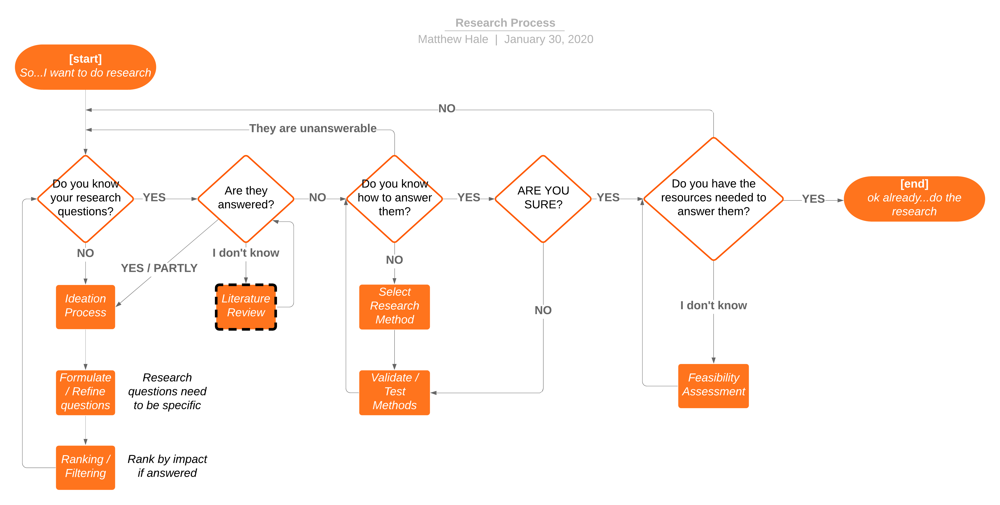
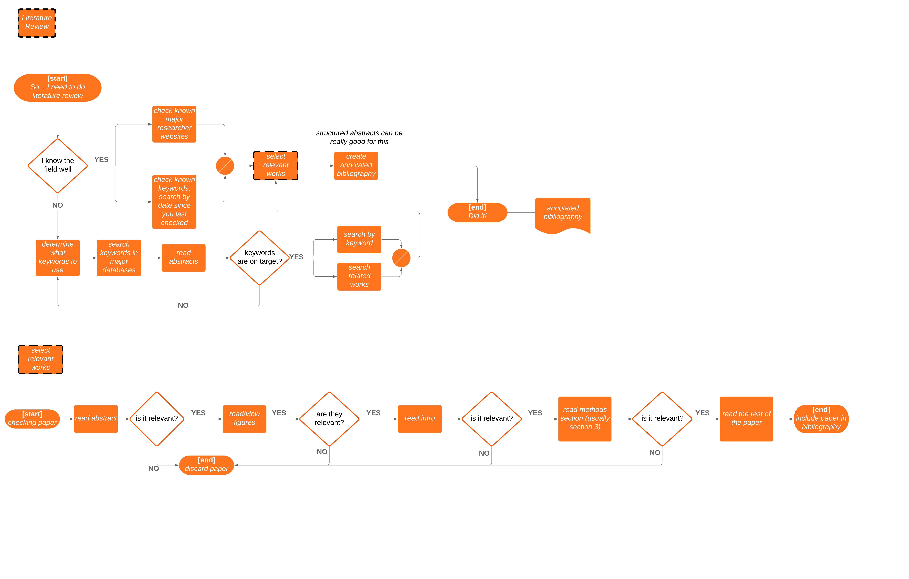
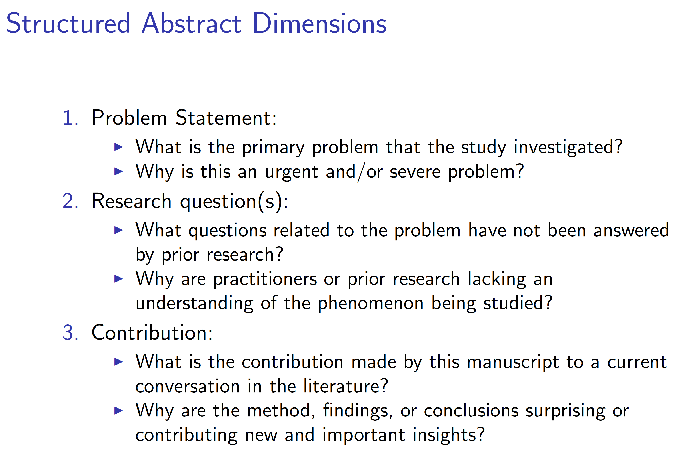
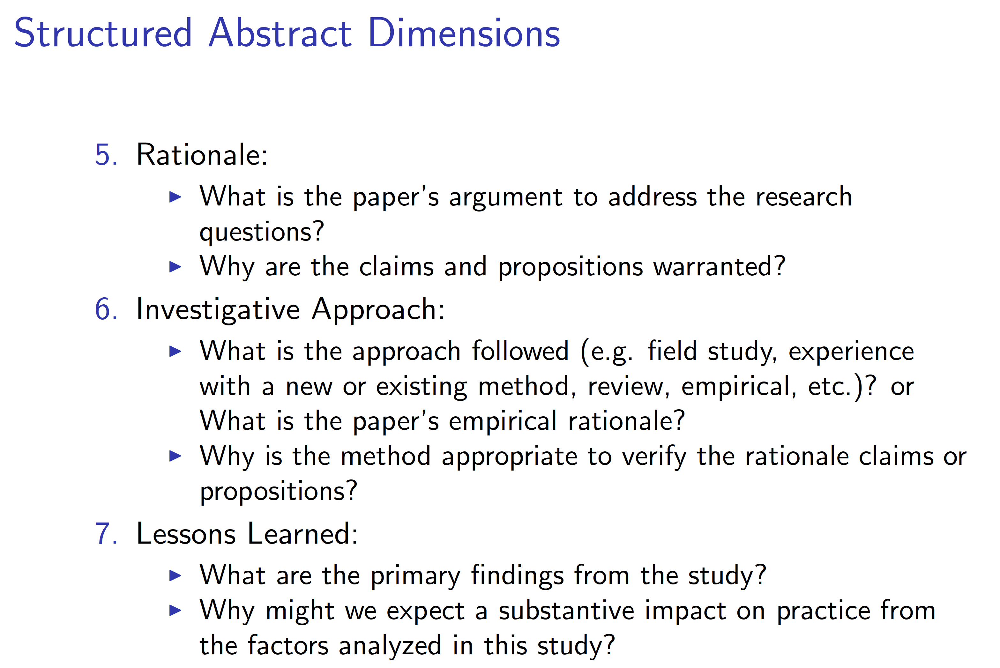
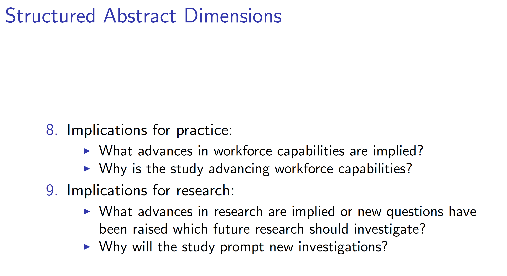

# Research Process
Conducting research well means understanding the process by which we discover new knowledge AND having a solid process for filtering through large amounts of information quickly. This mini-module helps prepare you to do research by laying out a clear flow chart of steps that one must go through / think about before conducting research.

## Overview
Overall, research begins when someone thinks about something they want to investigate. Exact questions may not be clear at first, but need to be constructed before research proceeds to far. The figure below overviews this process.

> Img credit: [Dr. Matt Hale](@mlhale), 2020

## Focus on literature review and paper filtering processes
Important within the overall process is the mechanism by which one chooses to do literature review. If done wrong, the process can result in missed resources that should have been considered and/or it can take a long time - as there can be thousands or millions of resources available related to any given idea or question.

The process below hones into the literature review block from the overall figure to better clarify how one might go about conducting a literature review. Generally, literature review continues over the life of the project.

> Img credit: Matt Hale, 2020

## Structured Abstracts
Structured abstracts are a certain type of annotated bibliography that uses a standard series of concrete questions to scaffold knowledge about a paper and aggregate it into a form that makes it useful for later parts of the research process.

The following three slides do a nice job of characterizing the process of structured abstract generation. The slides were created by [Dr. Robin Gandhi](@robinagandhi) in conjunction with the [Cybersecurity Skills Journal](https://www.csj.nationalcyberwatch.org/).

> Img credit: [Dr. Robin Gandhi](@robinagandhi) & [Cybersecurity Skills Journal](https://www.csj.nationalcyberwatch.org/) 2019

> Img credit: [Dr. Robin Gandhi](@robinagandhi) & [Cybersecurity Skills Journal](https://www.csj.nationalcyberwatch.org/) 2019

> Img credit: [Dr. Robin Gandhi](@robinagandhi) & [Cybersecurity Skills Journal](https://www.csj.nationalcyberwatch.org/) 2019

## Additional resources
Müller-Bloch, Christoph, and Johann Kranz. ["A framework for rigorously identifying research gaps in qualitative literature reviews."](https://pdfs.semanticscholar.org/7359/6c4957deab7c7a3fd1d4261994e47be1508c.pdf?_ga=2.222366163.95809279.1579792521-1621840368.1579792521) (2015).
